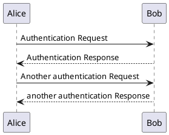
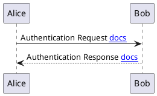

<h1 align="center">Docsify PUML</h1>

<p align="center">
    
</p>

<p align="center">Docsify plugin to parse PlantUML content</p>
<p align="center">
  
  
  
  

<p align="center">
 <a href="#install">Install</a> •
 <a href="#usage">Usage</a> •
 <a href="#features">Features</a> • 
 <a href="#options">Options</a> • 
 <a href="#examples">Examples</a> • 
 <a href="#meta">Meta</a> •
 <a href="#contributing">Contributing</a>
</p>

---

## Install
It's just simple like insert that into your `index.html`

```html
<script>
window.$docsify = {
  plantuml: {
    skin: 'default',
  },
}
</script>
...
<script src="//unpkg.com/docsify-puml/dist/docsify-puml.min.js"></script>
```

See [Options](#options) for more details.

## Usage

There are two ways to use that in your documentations. You can write directly into your *markdown* doc or you can import that from an external `.puml` file. 

### In code

Just create an code block with `plantuml` at lang type.

Ex.:

````markdown
### Section X


````

### Include External `.puml`

To include a `.puml` file into your doc, need to use an sitaxe like the `!include` from default PUML, but surrounded by `[[` and `]]`.

Ex.:

````markdown
### Section X

```plantuml
@startuml
[[!include ../assets/pumls/my-chart.puml]]

Alice -> Bob: Another authentication Request
Alice <-- Bob: another authentication Response
@enduml
```
````

## Features

- [x] Render as SVG object;
- [x] Parse link insed code;
- [x] Parse external includes;
- [x] Make image linkeable;
- [] Make image [zoomable](https://github.com/francoischalifour/medium-zoom);

## Options

At now, that are options we have, with default their values:

```json
{
  "skin": "default",
  "renderAsObject": false,
  "asLink": false,
  "serverPath": "https://custom-server.local/plantuml/png/"
}
```

### skin

That param says what skin(*theme*) should use in all *plantuml* blocks. By default, it's `default`, an clean implementation created by [@matthewjosephtaylor](https://github.com/matthewjosephtaylor).

| Value                                    | Description                                               |
| ---------------------------------------- | :-------------------------------------------------------- |
| `default`                                | An clean implementation                                   |
| `classic`                                | Default ~~ugly~~ PlantUML theme                           |
| `./assets/local-puml-theme.pu`           | An string pointing to a local file with your custom theme |
| `https://external.link/my-puml-theme.pu` | An url to a external server hosting a theme               |

### renderAsObject

That param says if any rendered object will be inside a `` tag (if `true`) or inside a `<object type='image/svg+xml' data=''/>` tag (if `false`).

That second option is most used when you want to interact with generated svg, like using links. To use with an link, for example, should be like that:

````markdown

````

> Note: Is **VERY IMPORTANT** use an `$` to say that is a link.

### asLink

That param says if your generate image would be a link to open on blank page. By default it's `false`.

> Note: Using with an `<object type='image/svg+xml' data=''/>` tag still not work properly.

### serverPath

That param says what server should use to render the svg. By default, use the [official PlantUML](https://www.plantuml.com/plantuml/svg/) server. If you're using an own server, set in this option. 

## Examples

For now, has three examples into [examples](./examples) folder:

- [Basic](./examples/basic) - with an in code implementation;
- [Themeable](./examples/themeable) - with a theme implementation (from external source theme);
- [Import PUML](./examples/import-pumls) - with implementation using an `.puml` file;

## Meta

Indie Atom – indieatom@gmail.com

> This repo is completelly based on [@imyelo](https://github.com/imyelo) [docsify-plantuml](https://github.com/imyelo/docsify-plantuml) version.

Distributed under the MIT license. See `LICENSE` for more information.

## Contributing

1. Fork it (<https://github.com/indieatom/docsify-puml/fork>)
2. Create your feature branch (`git checkout -b feature/fooBar`)
3. Commit your changes (`git commit -am 'Add some fooBar'`)
4. Push to the branch (`git push origin feature/fooBar`)
5. Create a new Pull Request
