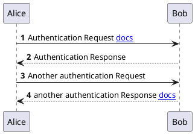

# Example

# Basic

```plantuml
@startuml
autonumber

Alice -> Bob: Authentication Request [[$./other-file docs]]
Bob --> Alice: Authentication Response

Alice -> Bob: Another authentication Request
Alice <-- Bob: another authentication Response [[$../other-file docs]]
@enduml
```
